# Poll

- How many are scared you'll fail Science One?

# Poll

- How many are scared bad grades in Science One will cause you to fail in life?

# Science One & Beyond

> - Science One 2006/2007
> - BSc, UBC Integrated Science 2010
> - UBC iGEM 2009
> - Married 2014
> - PhD, MIT Biological Engineering, expected 2017

---

# Science One 2006/2007

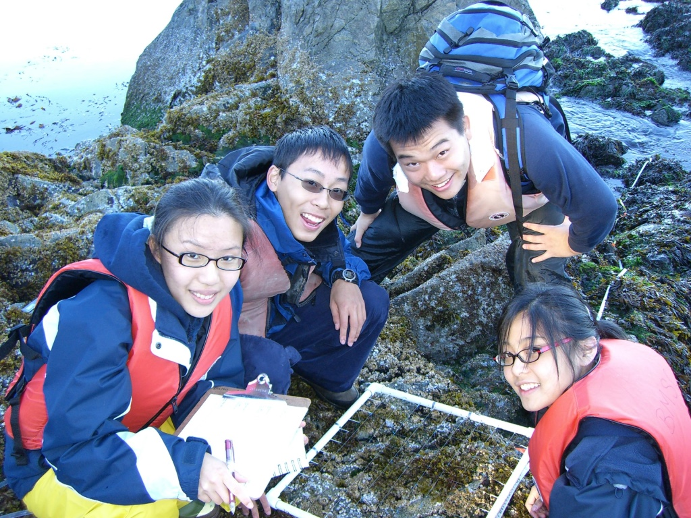

# Science One 2006/2007

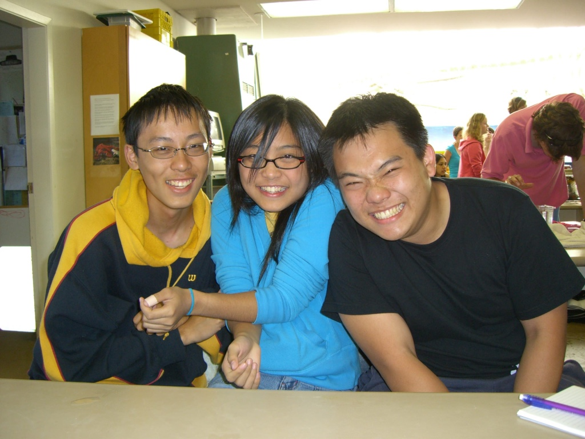

# Science One 2006/2007

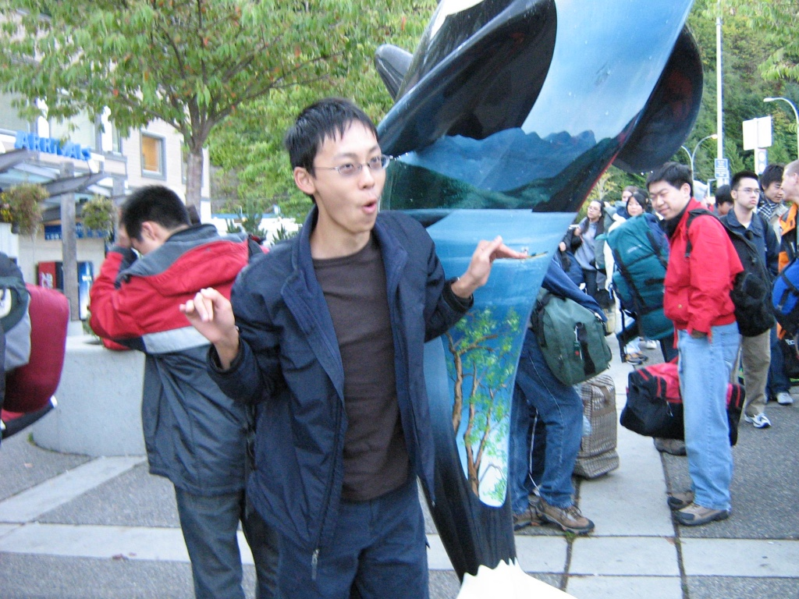

# Science One 2006/2007

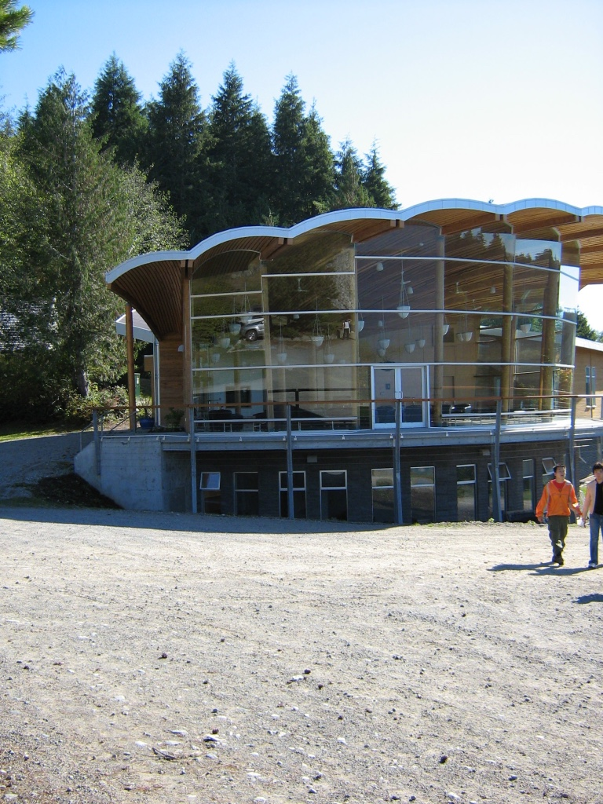

# Science One 2006/2007

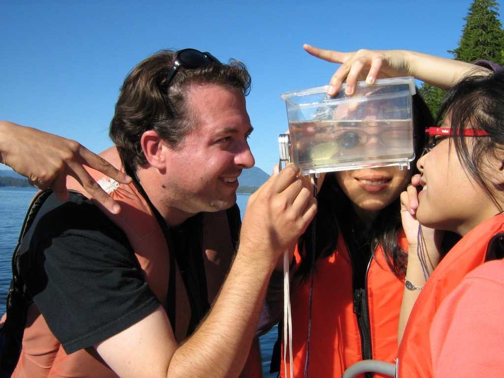

# Science One 2006/2007

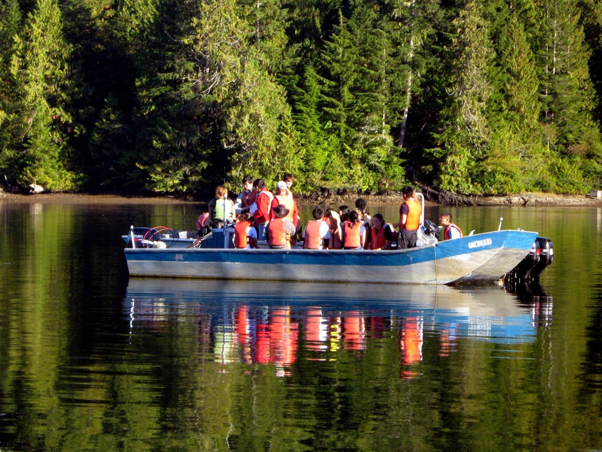

# Science One 2006/2007

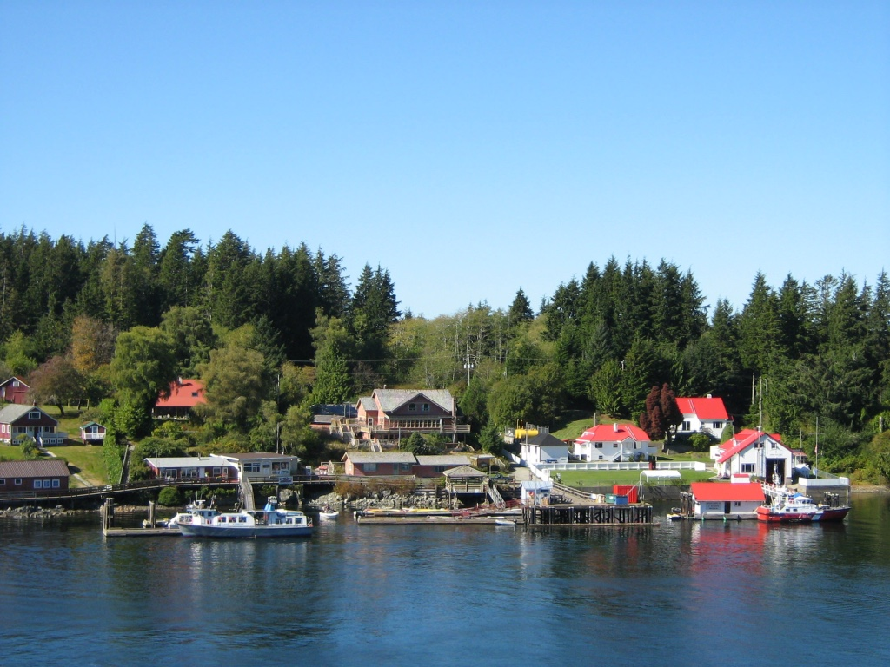

# Where are we now?

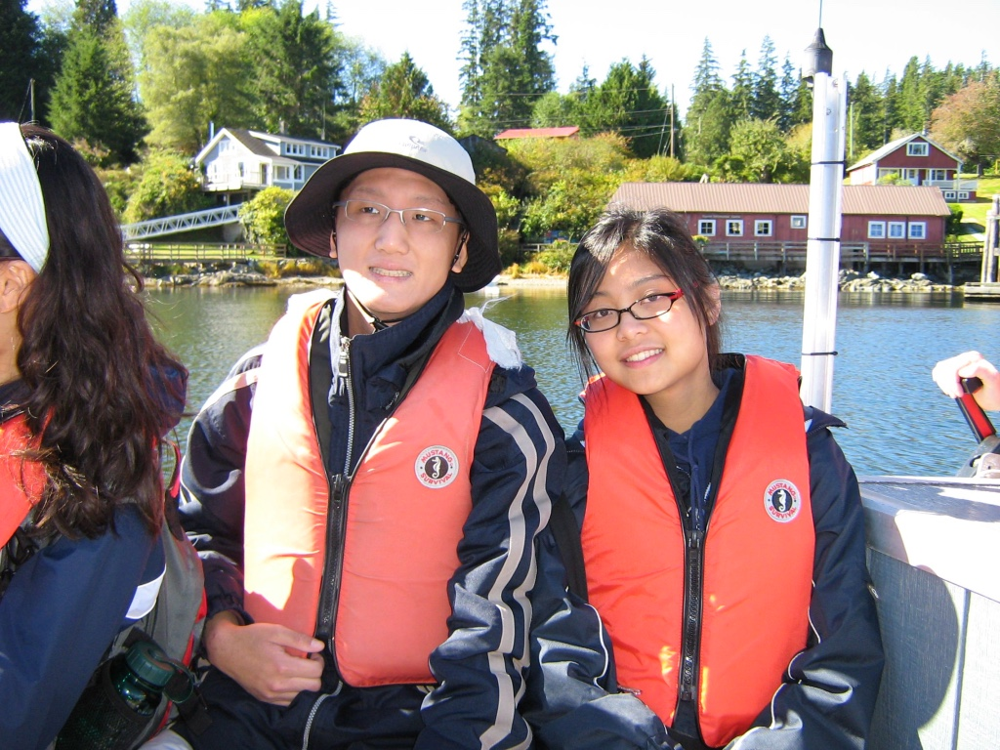

# Where are we now?

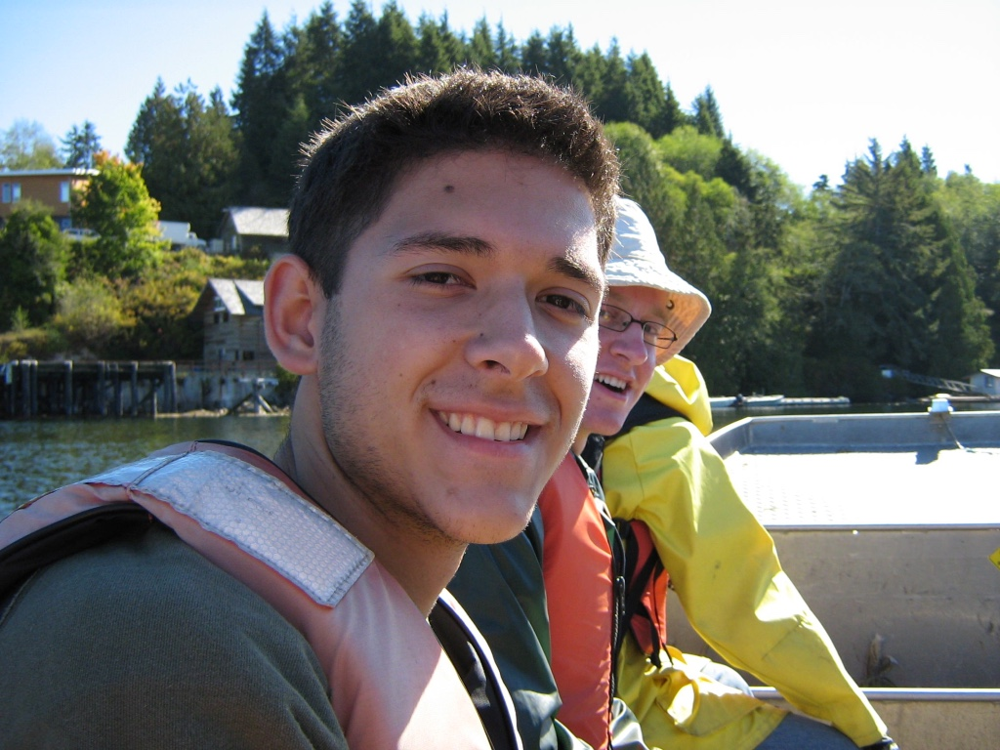

# Where are we now?

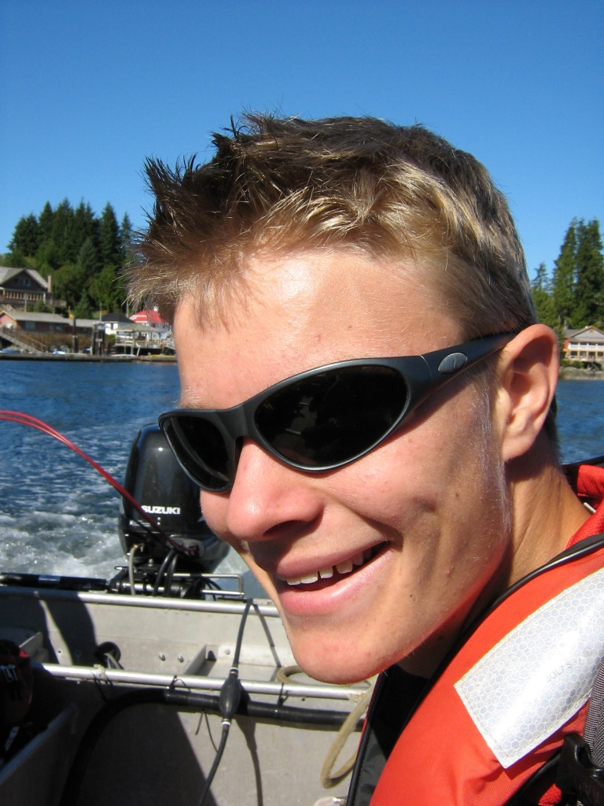

# Where are we now?

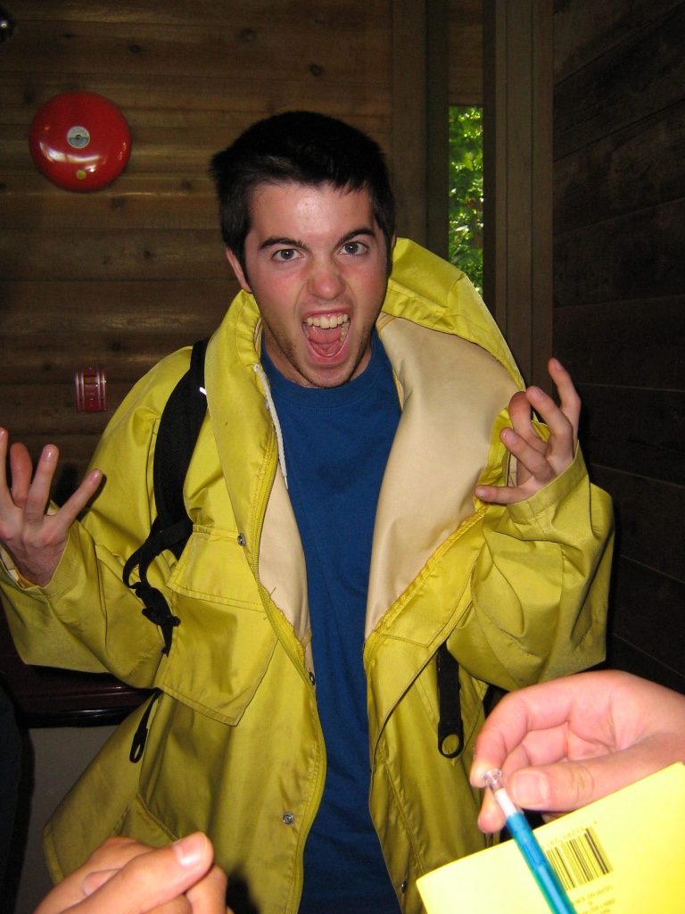

# Where are we now?

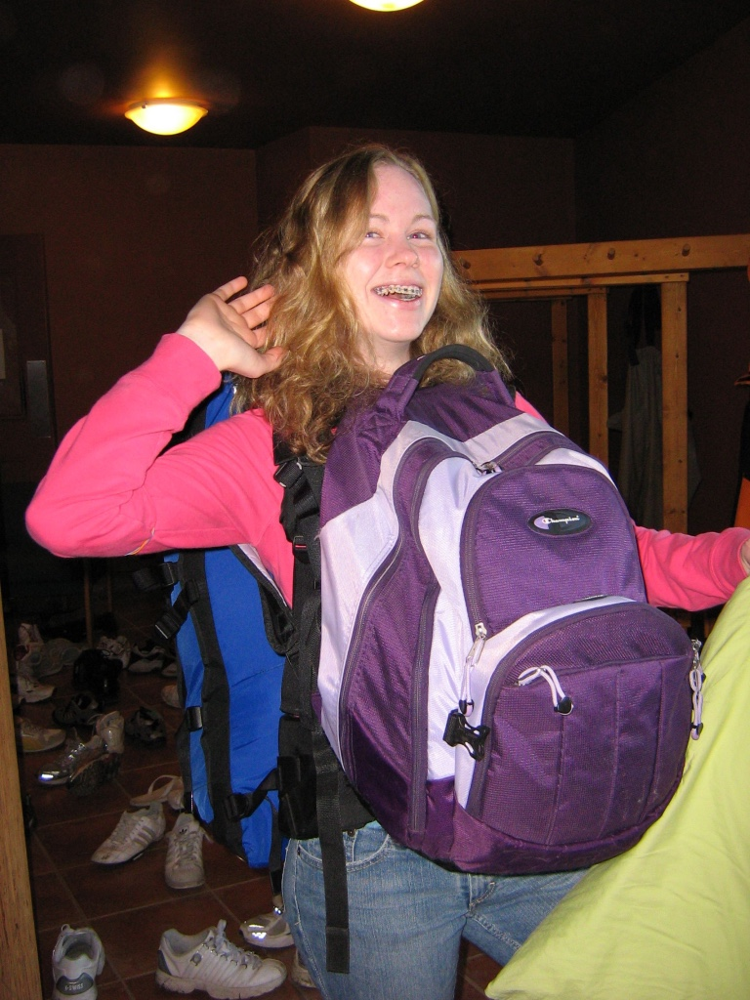

# Where are we now?

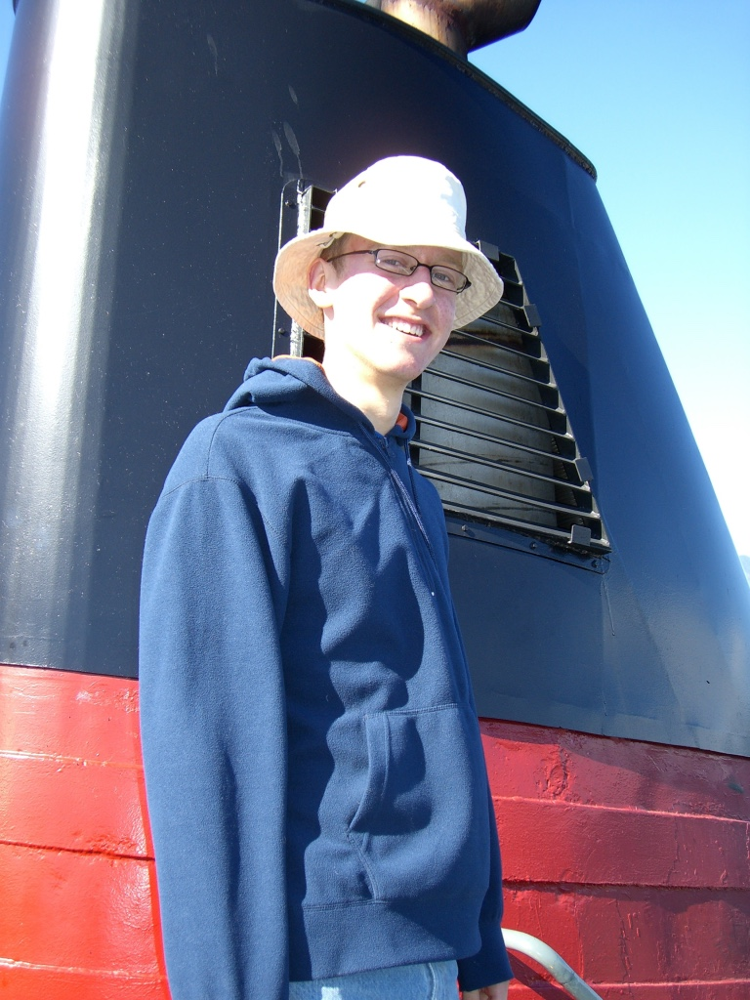

# Where are we now?

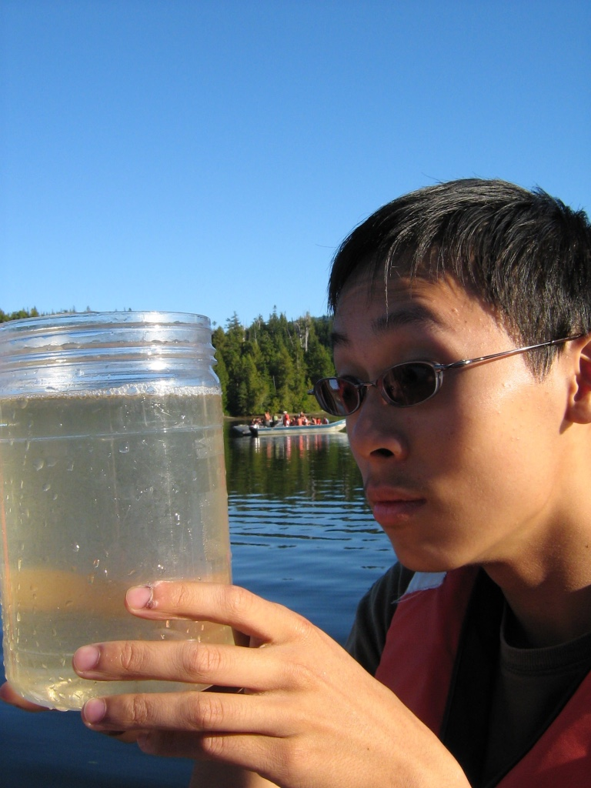

# Where are we now?

- Charles Z.: U Toronto, PhD Physics
- Tiffany T.: Global Development, somewhere in Africa
- Jacob B.: Twice my schoolmate: UBC & MIT, spoke last year
- Cindy Y.: U Toronto, grad school
- Mo C.: UC Berkeley, PhD EECS

# Story 1: Thinking in Scales, Thinking at Scale

- "If a piece of chalk were to be completely converted to energy, how many days of power would that piece of chalk provide to Vancouver?"
- "Do Pokemon height & weight combinations make sense for how they're drawn?"

# Story 1: Thinking in Scales, Thinking at Scale

- How much exactly does flu shuffle its genome in the world? A lesson in teaching myself computation.

# Story 2: Science as Measurement

- T1 Bamfield: "How long does it take a starfish to flip?"
- T2 project: "Do traditional Chinese herbs have antibacterial properties?"

# Story 2: Science as Measurement

- Systematically measuring how mutations affect phenotype.
  - Taking an engineering measurement approach in the life sciences.
- How much viral drug resistance is out there?

# Conclusion

- Think in scales, and think at scale.
- Learn how to measure with precision, and quantify your uncertainty.
- Have fun, it'll be great, you'll all do fine.
